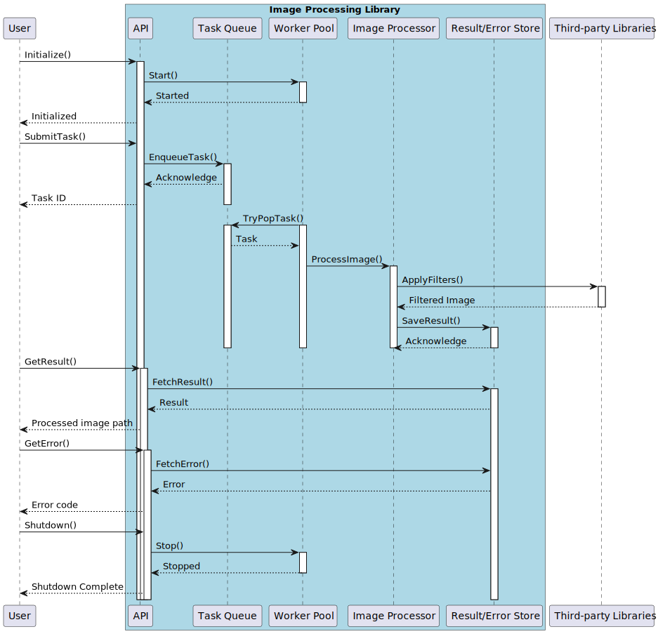

# Image Processing Library

## Overview

The Image Processing Library offers a robust and high-performance framework for filtering and processing images. Leveraging Intel's Threading Building Blocks (TBB) for lock-free programming, the library ensures high concurrency and parallelization capabilities. It is designed to handle a high load, processing up to 1 million images in short intervals. 

## Key Features

1. **Integration with Intel's TBB**:
   - Uses TBB's concurrent data structures, enabling lock-free programming and ensuring maximized parallel processing.
   - Ensures safe and efficient concurrent access to data, eliminating potential bottlenecks.

2. **High Load Processing Capabilities**:
   - Able to handle massive batches of images, up to 1 million, in a short time frame.
   - Optimized for both large-scale tasks and finer-grained operations.

3. **Asynchronous Image Processing**:
   - All image processing tasks are executed asynchronously, ensuring that user requests are not blocked.
   - Provides a non-blocking approach, enhancing the application's overall responsiveness.

4. **User-friendly API**:
   - The library's interface is clearly defined in the `api.hpp`.
   - Offers a clean and intuitive interface for users to interact with, simplifying tasks like filter application, task submission, and result retrieval.

5. **Comprehensive Responsibility Model**:
   - The library autonomously manages processing, parallelization, and resource allocation.
   - Users can trust the library to handle complex operational intricacies, allowing them to focus solely on their image processing goals.

6. **Third-party Library Integration**:
   - Seamlessly incorporates filters and functionalities from third-party libraries, enhancing the processing variety.
   - Each third-party library, like `lib1` through `lib5`, specializes in unique filters, broadening the range of available image effects.

7. **Efficient Error Handling and Reporting**:
   - Actively monitors all processing tasks, logging errors and issues encountered.
   - Successfully processed image results are stored for easy retrieval, ensuring users can access their data promptly.

## Conclusion

The Image Processing Library stands as a testament to high-performance, large-scale image processing. Through its integration with Intel's TBB and a commitment to lock-free programming, it guarantees swift, parallel operations. With its capacity to handle up to 1 million images concurrently and its asynchronous processing approach, users can trust it for even the most demanding tasks. Its intuitive API, resource management, and expansive filter range, all ensure a premium, user-centric experience.

## How the library works

